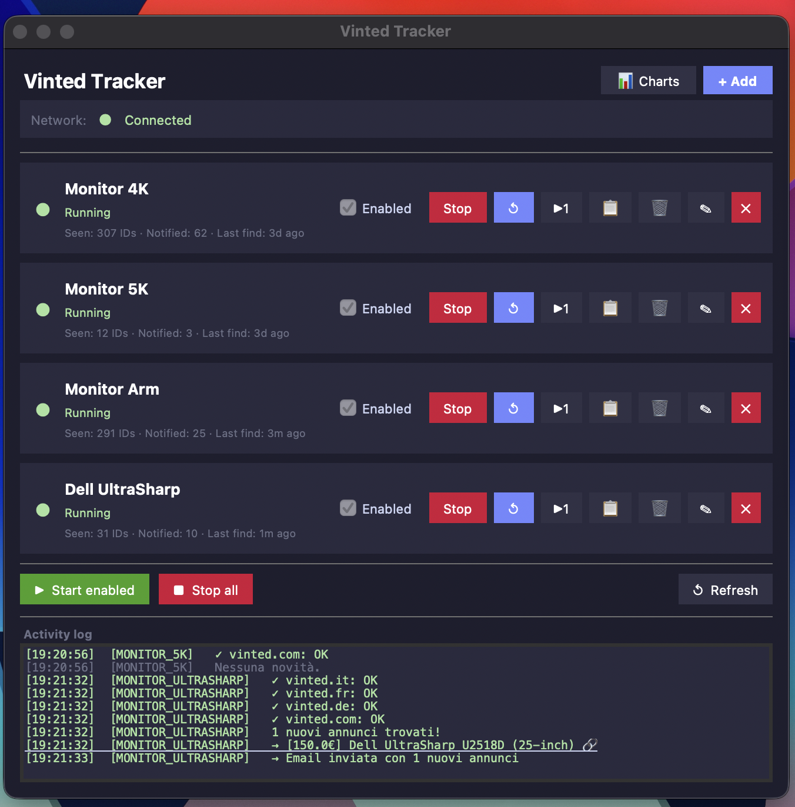
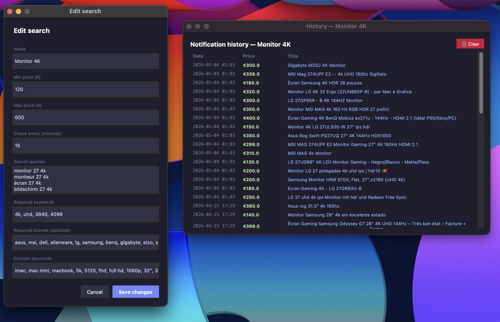

# Vinted Tracker

A desktop tool that watches [Vinted](https://www.vinted.com) for you and sends an email the moment a new listing matches your search — for anything.

> You can track monitors, keyboards, phones, sneakers, vintage clothing, or whatever you want.
> Each search is independently configurable with its own keywords, price limit, and brand filters.


---

## Screenshots






---

## Features

- Track **any search** across Vinted Italy, France, Germany and .com simultaneously
- **Email alerts** as soon as a new matching listing appears
- **Smart WiFi handling** — if you lose connection, a full scan runs the moment it comes back
- **GUI** to manage all your searches in one place (start, stop, restart, add, remove)
- **Live log** — see scraping results in real time inside the app
- Easily **add new searches** through the UI without touching any code

---

## Getting Started

### 1. Clone & install dependencies

```bash
git clone https://github.com/your-username/vinted-tracker.git
cd vinted-tracker
pip install -r requirements.txt
```

### 2. Configure email credentials

```bash
cp settings.example.json settings.json
```

Open `settings.json` and fill in your details:

```json
{
  "smtp_user": "your_gmail@gmail.com",
  "smtp_pass": "your_app_password",
  "email_to":  "destination@email.com"
}
```

> **Gmail users:** you need an [App Password](https://myaccount.google.com/apppasswords), not your regular password.

### 3. Launch the GUI

```bash
python gui.py
```

---

## Adding a new search

Click **+ Add** in the app and fill in the form:

| Field | Description | Example |
|---|---|---|
| Name | A label for this search | `iPhone 15 Pro` |
| Min price (€) | Minimum price in € | `0` |
| Max price (€) | Maximum price in € | `800` |
| Check every (minutes) | How often to scan | `15` |
| Search queries | One Vinted search term per line | `iphone 15 pro` |
| Required keywords | All results must include at least one | `iphone,15 pro` |
| Required brands (optional) | Must match a brand | `apple` |
| Exclude keywords | Disqualify listings containing these | `broken,spare parts` |

The config is saved to `configs/` and picked up automatically — no restart needed.

---

## Running a monitor manually (without the GUI)

```bash
python monitor.py --config configs/monitor_5k.json
```

---

## Project Structure

```
├── gui.py                  # GUI entry point — run this to open the app
├── monitor.py              # Monitor runner — launched by the GUI per search
│
├── core/
│   ├── network.py          # Internet connectivity checks + WiFi-aware sleep
│   ├── scraper.py          # Vinted scraping logic and item filtering
│   ├── notifier.py         # Email notification sender
│   └── storage.py          # Persistence: seen IDs and price reference DB
│
├── configs/                # One JSON file per active search
│   ├── monitor_4k.json
│   └── monitor_5k.json
│
├── data/                   # Auto-generated at runtime (gitignored)
│   └── seen_*.json         # Tracks which listings have already been notified
│
├── settings.json           # Your email credentials (gitignored)
├── settings.example.json   # Template — copy this to settings.json
└── requirements.txt
```

---

## Config file reference

Each file in `configs/` follows this schema:

```jsonc
{
  "id":                     "my_search",       // unique identifier (auto-generated by GUI)
  "label":                  "iPhone 15 Pro",   // display name in the GUI
  "max_price":              800,               // skip listings above this price
  "check_interval_minutes": 15,               // how often to scan
  "seen_file":              "seen_my_search_ids.json",  // stored in data/
  "price_db_file":          null,             // optional: path to a price reference JSON
  "domains": [
    "https://www.vinted.it",
    "https://www.vinted.fr",
    "https://www.vinted.de",
    "https://www.vinted.com"
  ],
  "queries":            ["iphone 15 pro"],
  "keywords_required":  ["iphone", "15 pro"],  // at least one must match
  "brands_required":    ["apple"],             // at least one must match (or empty = any)
  "keywords_exclude":   ["rotto", "broken"],   // listing is skipped if any match
  "email_subject":      "🔔 {count} nuovo/i articolo/i su Vinted — iPhone 15 Pro!",
  "email_intro":        "Nuovi annunci trovati su Vinted per: iPhone 15 Pro"
}
```

---

## Requirements

- Python 3.11+
- A Gmail account with App Password enabled
- macOS / Linux (Windows untested)
